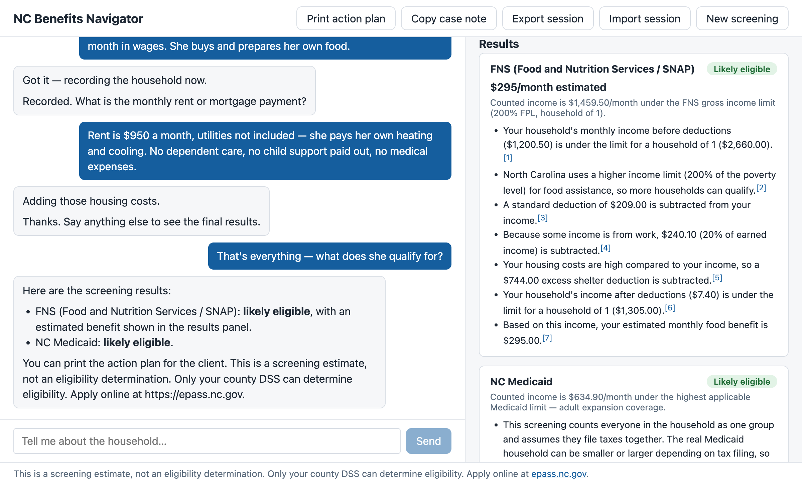

# NC Benefits Navigator

An open-source screening assistant for North Carolina nonprofit and social-work
staff: a caseworker describes a client's household in plain English, and the
tool estimates the household's likely eligibility for **FNS (SNAP/food stamps)**,
**NC Medicaid**, **WIC**, and the **Lifeline phone/internet discount**, with
every conclusion cited to the governing policy manual
and a printable action plan for the client. **The AI never decides
eligibility** — a deterministic, auditable rules engine makes every
determination; the AI only conducts the interview and records facts, all of
which stay visible and editable on screen. **Nothing is stored**: sessions live
in memory and vanish when they end. No database, no accounts, no client records.



**Live demo:** <https://nc-benefits-navigator.fly.dev> — example data only, please.

## Run it

```
docker run -p 8000:8000 -e ANTHROPIC_API_KEY=sk-... ghcr.io/keeganburkart/nc-benefits-navigator
```

Then open <http://localhost:8000>. That's the whole install.

## What it screens

| Program | What the engine checks | Governing manual |
|---|---|---|
| **FNS / SNAP** | NC's broad-based categorical eligibility (200% FPL gross test), the federal net income test, the full deduction chain (standard, 20% earned income, dependent care, child support paid, elderly/disabled medical, excess shelter with utility allowance), and the Thrifty Food Plan benefit estimate | [NC FNS Manual](https://policies.ncdhhs.gov/divisional-n-z/social-services/food-and-nutrition-services/) |
| **NC Medicaid (MAGI)** | Per-member screening across coverage groups — children (including CHIP-level), pregnant women, parents/caretakers, and expansion adults — with the 5% MAGI disregard | [NC Medicaid manuals](https://policies.ncdhhs.gov/divisional-n-z/social-services/family-and-childrens-medicaid/) |
| **WIC** | Categorical test (pregnant member or child under 5, counting each pregnancy as an extra household member) plus the 185% FPL gross income test, with adjunctive income eligibility when the household screens FNS- or Medicaid-eligible | [7 CFR 246.7](https://www.ecfr.gov/current/title-7/subtitle-B/chapter-II/subchapter-A/part-246/subpart-C/section-246.7) |
| **Lifeline (phone/internet)** | The 135% FPL gross income test, plus the qualifying-program pathway (reported SSI income, or an FNS/Medicaid-eligible screen), with the $9.25/month support amount | [47 CFR 54.409](https://www.ecfr.gov/current/title-47/chapter-I/subchapter-B/part-54/subpart-E/section-54.409) |

Every reason in a result links to the specific manual section behind it — see
[docs/rules.md](docs/rules.md) for the complete rule-by-rule reference.

## Honest limitations

This is a **screener, not an eligibility determination** — only a county DSS
caseworker can determine eligibility, and the UI says so on every screen and
every printout. Known v1 simplifications:

- **Mixed-immigration-status households are simplified.** Members without a
  qualifying status are excluded from the FNS household size, but their income
  is counted **in full** rather than prorated per NC's rules — so estimates for
  mixed-status households are deliberately conservative (the real benefit may
  be higher). The result says this when it applies.
- **The MAGI household is simplified to the whole household.** Real Medicaid
  household composition follows tax-filing relationships; the caseworker must
  confirm it. The tool says this in its results.
- **No aged/blind/disabled (ABD) Medicaid.** Members 65+ are flagged for a
  caseworker hand-off rather than screened — ABD Medicaid uses entirely
  different rules.
- **The parent/caretaker Medicaid limit uses NC's published MAF-C/N dollar
  standard** for the whole-household size; the real standard depends on the
  Medicaid household's exact composition, and the results say a caseworker
  must confirm it.
- **FNS student restrictions are not modeled.** The interview records
  `is_student`, but no rule reads it: FNS restricts students age 18–49 enrolled
  half-time or more in higher education unless they meet an exemption (working
  20+ hours/week, caring for a young child, and others). A household with such
  a student can screen likely eligible here and still be denied — a caseworker
  must apply the student rules.
- **Homeless households are not modeled** (the shelter-deduction path assumes a
  rent or mortgage figure).
- **WIC's postpartum/breastfeeding window is not tracked.** The tool only sees
  current pregnancies and ages, so a recently-pregnant member may screen
  ineligible; the result tells the caseworker to ask a WIC office.
- **WIC and Lifeline "adjunctive" results are contingent.** Enrollment in
  Medicaid or FNS — not a screening — is what actually confers automatic
  eligibility; the results word this as "if approved there."
- English only (Spanish is the first item on the wishlist).

## Docs

- [Adopting this at your organization](docs/adopting.md) — for directors with no IT staff
- [Rules reference](docs/rules.md) — every rule, its citation, and how annual updates work
- [Contributing](docs/contributing.md) — dev setup, tests, adding a program

## License

[MIT](LICENSE). Not affiliated with NC DHHS.
